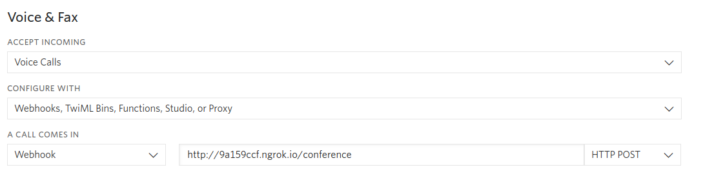

<a href="https://www.twilio.com">
  
</a>

# Rapid Response Kit: Building Conferencing and Broadcasting with Twilio. Level: Intermediate. Powered by Twilio - Ruby on Rails


> This template is part of Twilio CodeExchange. If you encounter any issues with this code, please open an issue at [github.com/twilio-labs/code-exchange/issues](https://github.com/twilio-labs/code-exchange/issues).

## About

An example application implementing an disaster response kit that allows an organizer to instantly communicate with volunteers. This application is built with Ruby on Rails. 

For a step-by-step tutorial, [visit this link](https://www.twilio.com/docs/howto/walkthrough/conference-broadcast/ruby/rails).

Implementations in other languages:

| .NET | Java | Python | PHP | Node |
| :--- | :--- | :----- | :-- | :--- |
| [Done](https://github.com/TwilioDevEd/conference-broadcast-csharp)  | [Done](https://github.com/TwilioDevEd/conference-broadcast-spark)  | TBD  | [Done](https://github.com/TwilioDevEd/conference-broadcast-laravel) | TBD |

## Set up

### Requirements
- [Ruby](https://www.ruby-lang.org/) **2.6.x** version.
- [Node.js](https://nodejs.org/en/) **10.x** or **12.x** version

### Twilio Account Settings

This application should give you a ready-made starting point for writing your own application.
Before we begin, we need to collect all the config values we need to run the application:

| Config Value | Description |
| :----------- | :---------- |
| TWILIO_ACCOUNT_SID  | Your primary Twilio account identifier - find this [in the Console](https://www.twilio.com/console). |
| TWILIO_AUTH_TOKEN   | Used to authenticate - [just like the above, you'll find this here](https://www.twilio.com/console). |
| TWILIO_NUMBER | A Twilio phone number in [E.164 format](https://en.wikipedia.org/wiki/E.164) - you can [get one here](https://www.twilio.com/console/phone-numbers/incoming) |

### Local development

1. First clone this repository and `cd` into it

   ```bash
   git clone https://github.com/TwilioDevEd/conference-broadcast-rails.git
   cd conference-broadcast-rails
   ```

2. Install the dependencies

   ```bash
   make install
   ```

3. Copy the sample configuration file and edit it to match your configuration

   ```bash
   cp .env.example .env
   ```

   See [Twilio Account Settings](#twilio-account-settings) to locate the necessary environment variables.

4. Setup server
   ```bash
   make serve-setup
   ```

5. Run the server, the following command will run the application on port 3000.

   ```bash
   make serve
   ```

6. Expose your application to the wider internet using [ngrok](http://ngrok.com). This step
   **is important** because the application won't work as expected if you run it through
   localhost. You can read [this blog post](https://www.twilio.com/blog/2015/09/6-awesome-reasons-to-use-ngrok-when-testing-webhooks.html)
   for more details on how to use ngrok.

   ```bash
   ngrok http 3000
   ```

7. Once ngrok is running, open up your browser and go to your ngrok URL. It will
   look something like this: 
   
   ```
   http://9a159ccf.ngrok.io
   ```

8. Configure Twilio to call your webhooks You will also need to configure Twilio to call your application when calls are received.

   You will need to provision at least one Twilio number with voice capabilities so the application's users can participate in conferences. You an buy a number right [here](https://www.twilio.com/console/phone-numbers/search). Once you have a number you need to configure your number to work with your application. Open the [number management page](https://www.twilio.com/console/phone-numbers/incoming) and open a number's configuration by clicking on it.

   Remember that the number where you change the voice webhooks must be the same one you set on the TWILIO_NUMBER environment variable.

   ```
   http://9a159ccf.ngrok.io/conference (POST)
   ```

   

9. Navigate to your `ngrok URL` for example http://9a159ccf.ngrok.io

That's it!

### Docker

If you have [Docker](https://www.docker.com/) already installed on your machine, you can use our `docker-compose.yml` to setup your project.

1. Make sure you have the project cloned.
2. Setup the `.env` file as outlined in the [Local Development](#local-development) steps.
3. Run `docker-compose up`.
4. Follow the steps in [Local Development](#local-development) on how to expose your port to Twilio using a tool like ngrok and configure the remaining parts of your application.

### Test

You can run the tests locally by typing:

```bash
bundle exec rails test
```

### Cloud deployment

Additionally to trying out this application locally, you can deploy it to a variety of host services. Here is a small selection of them.

Please be aware that some of these might charge you for the usage or might make the source code for this application visible to the public. When in doubt research the respective hosting service first.

| Service                           |                                                                                                                                                                                                                           |
| :-------------------------------- | :------------------------------------------------------------------------------------------------------------------------------------------------------------------------------------------------------------------------ |
| [Heroku](https://www.heroku.com/) | [](https://heroku.com/deploy)                                                                                                                                       |

## Resources

- The CodeExchange repository can be found [here](https://github.com/twilio-labs/code-exchange/).

## Contributing

This template is open source and welcomes contributions. All contributions are subject to our [Code of Conduct](https://github.com/twilio-labs/.github/blob/master/CODE_OF_CONDUCT.md).

[Visit the project on GitHub](https://github.com/twilio-labs/sample-template-nodejs)

## License

[MIT](http://www.opensource.org/licenses/mit-license.html)

## Disclaimer

No warranty expressed or implied. Software is as is.

[twilio]: https://www.twilio.com
